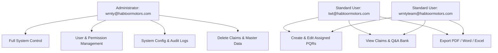

# Database Architecture, User Hierarchy & RBAC Permissions Matrix

This document outlines the data model, storage mechanisms, user role definitions, and access control policies for the PQR & OEM Claim Management System.

---

## 1. User Hierarchy & Role-Based Access Control (RBAC)

### User Role Definitions



### Granular Permissions Matrix

| Feature / Module | Administrator (`wrnty@...`) | Standard User (`twt@...`) | Standard User (`wrntyteam@...`) |
|---|:---:|:---:|:---:|
| **View PQR Records & Search** | ✅ Yes | ✅ Yes | ✅ Yes |
| **Create New PQR Records** | ✅ Yes | ✅ Yes | ✅ Yes |
| **Edit PQR Records** | ✅ Yes | ✅ Yes | ✅ Yes |
| **Delete PQR Records** | ✅ Yes | ❌ No | ❌ No |
| **User & Role Management** | ✅ Yes | ❌ No | ❌ No |
| **Permission Management** | ✅ Yes | ❌ No | ❌ No |
| **Export Reports (PDF / Word / Excel)** | ✅ Yes | ✅ Yes | ✅ Yes |
| **System & Sheet Configuration** | ✅ Yes | ❌ No | ❌ No |
| **View Audit Trail Logs** | ✅ Yes | ❌ No | ❌ No |
| **Manage OEM Brands & Aggregates** | ✅ Yes | ❌ No | ❌ No |

---

## 2. Audit Trail Engine Specification

Whenever a PQR is created, edited, saved, or modified, the system automatically records the following metadata:

### TypeScript Interface:
```typescript
export interface AuditTrailInfo {
  updatedBy: string;   // e.g. "wrnty@habtoormotors.com"
  date: string;        // e.g. "23-Aug-2026"
  time: string;        // e.g. "09:35 AM GST"
  timestamp: string;   // e.g. "2026-08-23T09:35:42+04:00"
  action?: string;     // e.g. "Created", "Saved", "Status Update"
}
```

### Standard Storage Format (Google Sheet Last Column):
```text
Updated By: wrnty@habtoormotors.com
Date: 23-Aug-2026
Time: 09:35 AM GST
Timestamp: 2026-08-23T09:35:42+04:00
```

---

## 3. Storage Layer Architecture

The application implements a resilient, multi-tier data architecture:

```
+-------------------------------------------------------------+
|                      React UI Layer                         |
+-------------------------------------------------------------+
                              |
      +-----------------------+-----------------------+
      |                                               |
+-----v---------------+                     +---------v-------+
|  Primary Store:     |                     |  Remote Store:  |
|  Google Sheets      |                     |  IndexedDB      |
|  (PQR, WarrantyQA,  |                     |  (pqr_records)  |
|   Service Interval) |                     +---------+-------+
+---------------------+                               |
                                            +---------v-------+
                                            |  Local Storage  |
                                            |  (Session, Auth,|
                                            |   Queue, Audit) |
                                            +-----------------+
```

1. **Google Sheets (Primary Central Repository)**:
   - Shared in real-time across all authorized warranty team members.
   - Preserves all historical records, custom questions, and service intervals.
2. **IndexedDB (Local High-Performance Store)**:
   - Stores offline drafts, high-resolution photo assets, and offline sync queues.
3. **LocalStorage (Configuration & Session Store)**:
   - Stores encrypted session tokens, user profiles, and the audit log ring buffer (last 1,000 events).
